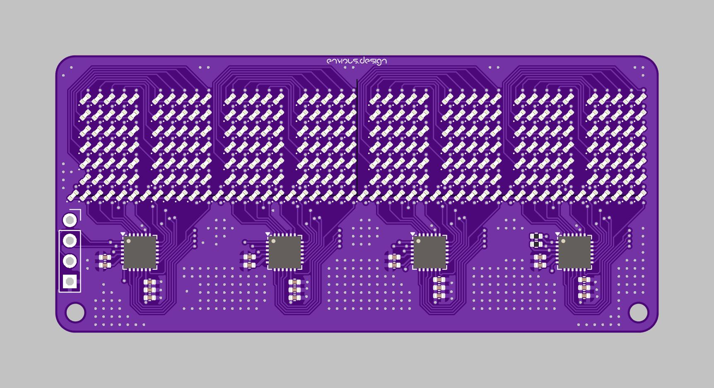

# Env8Ndisplay
 A 40x7 display using x4 is37fl3130

## Info:
I designed a clock a while ago using 8x LTP-305s, LTP-305s and TIL-305s are both discontinued but I made a PCBA replica called DIY305, Ive also just put LEDs on a PCB in the same arangement which this repo is one of them.

I quite like character displays which is why I made this one, there is some demo code in the firmware folder that makes use of the pico SDK so wire it up to the a pico making sure VCC goes to 3V3 and not VBUS or VSYS unless you want to use a level shifter, a number of ICs can handle different logic level voltage if needed but this one tends to glitch out in my experience.

